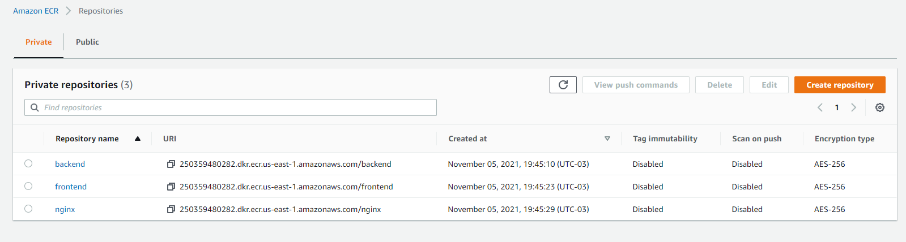
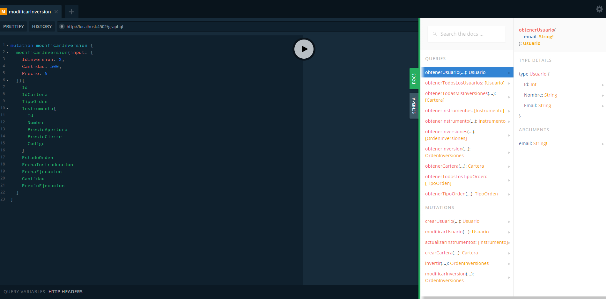
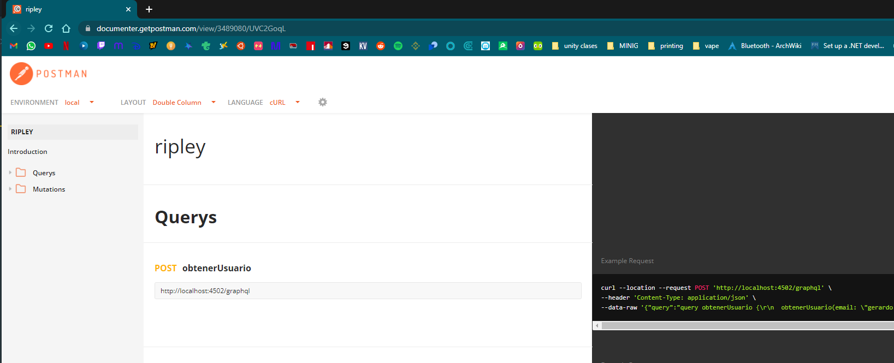

# Problema practico

Resolucion del problema practico planteado en el readme principal

# Motivacion

Crear arquitectura y proyectosa asociados a la prueba practica

# Resumen
Para resumir, entre todas las tareas, las que se abordaron fueron la de arquitectura, backend y frontend.

### Oportunidad de mejora:
- La logica para obtener los instrumentos no queda muy clara o como realizar la logica de esta, por tal existe una oportunidad de mejora para tener un historial de instrumentos.
- Cron para obtener instrumentos; la api para actualizar los instrumentos esta hecha, es cosa de crear un Cron que llame a esta api cada X tiempo, recomiendo realizar un proyecto "crons" en node.js y que realize esta llamada cada X tiempo.
- Existe una tabla "usuariohistorico"; la idea es 1 vez al mes con un cron rellenar esta tabla con el resultado mensual del usuario, o el diario, como se quiera, esto para evitar realizar querys pesadas en la base de datos.
- Agregarle usuario y contraseña a la pagina, para evitar que usuarios externos sin credenciales se conecten.

### Que falto:
- El Frontend se realizo en Angular ya que es lo que solicitaban, pero yo no tengo experiencia con el, de igual manera me propuse a realizarlo, en resumen, se hizo el Listar todos los usuarios, agregar usuario, modificar usuario y comprar inversiones, todo lo demas se omitio por tiempo.
- En un punto se solicita utilizar Api Gateway, se intento crear una llamando a un NLB (Network Load Balancer) para llamar al EKS, pero sin exito, por tal se opto por el balanceador creado por kubernetes, se puede ver como quedo en el diagrama de arquitectura.

# Arquitectura

Para levantar la arquitectura es necesario definir ciertas cosas antes de crearla, en este caso solo se uso serverless para crear permisos necesarios

ir a la carpeta ./aws/yml/ y ejecutarla

``$ sls deploy --stage prod --aws-profile=TuPerfil``

tomar el rol creado y pasarlo al archivo ./aws/scripts/cluster.sh donde corresponde, cambiar el --profile por el que corresponda

recordar que el perfil que coloques tiene que tener acceso a eks:CreateCluster si no dara error, por tal tambien se crea un rol kubernetesUserRole para asignarle al usuario, pero igual sera necesario agregar el eks:CreateCluster

Crear el nodegroup ./aws/scripts/nodegroup.sh

## Crear repositorios ECR


## Diagrama Arquitectura


## Diagrama Base de datos

# Backend

El backend esta creado con node js y graphql, para realizar querys se puede hacer un post a ```http://localhost:4502/graphql```

Si queremos ver la documentacion, podemos ingresar directo a la ruta del post y nos mostrara apollo para crear querys, ver el esquema y la documentacion



Tambien estan publicadas en postman todos los post's y querys disponibles https://documenter.getpostman.com/view/3489080/UVC2GoqL

[](https://documenter.getpostman.com/view/3489080/UVC2GoqL)


# Respuestas

- Feature 1 (¿Que inversiones tengo?): Obtener todas las inversiones (Instrumentos y cantidad de acciones) de la cartera del señor Risopatron.
```
query obtenerTodasMisInversiones {
  obtenerTodasMisInversiones(email: "gerardo.manuel3@gmail.com"){
    Id
    IdUsuario
    Descripcion
    EstadoActivo
    OrdenInversiones {
      Id
      IdCartera
      TipoOrden
      Instrumento{
        Id
        Nombre
        PrecioApertura
        PrecioCierre
        Codigo
      }
      EstadoOrden
      FechaInstroduccion
      FechaEjecucion
      Cantidad
      PrecioEjecucion
    }
  }
}
```

- Feature 2 (Quiero invertir en otra cosa!): Agregar una inversión a la cartera del señor Risopatron. (Numero de acciones, Fecha de ultima actualización, Nombre, Monto de Inversión en CLP)
```
mutation invertir {
  invertir(input: {
    IdCartera: 1,
    IdTipoOrden: 1,
    IdInstrumento: 1,
    Cantidad: 10,
    Precio: 10
  }){
    Id
    IdCartera
    TipoOrden
    Instrumento{
      Id
      Nombre
      PrecioApertura
      PrecioCierre
      Codigo
    }
    EstadoOrden
    FechaInstroduccion
    FechaEjecucion
    Cantidad
    PrecioEjecucion
  }
}
```

- Feature 3 (Quiero invertir mas): Actualizar una inversión a la cartera del señor Risopatron. (Numero de acciones, Fecha de ultima actualización, Nombre, Monto de Inversión en CLP Actualizado)
```
mutation modificarInversion {
  modificarInversion(input: {
    IdInversion: 2,
    Cantidad: 500,
    Precio: 5
  }){
    Id
    IdCartera
    TipoOrden
    Instrumento{
      Id
      Nombre
      PrecioApertura
      PrecioCierre
      Codigo
    }
    EstadoOrden
    FechaInstroduccion
    FechaEjecucion
    Cantidad
    PrecioEjecucion
  }
}
```

- Feature 4 (¿Como van mis inversiones en Colbun S.A?): Obtener el estado (Rentabilidad y estado de inversión) de un instrumento en particular de la cartera.
```"Obtiene todas las ordenes asiganadas a la cartera y instrumento"```

```
query obtenerInversionPorInstrumento {
  obtenerInversionPorInstrumento(idCartera: 1, idInstrumento: 1){
      Instrumento{
        Nombre
      }
      EstadoOrden
      Rentabilidad
  }
}
```

- Feature 5 (¿Como van mis inversiones, hoy estamos ganando o perdiendo?): Obtener el estado (Rentabilidad y estado de inversión) de toda la cartera.
```
query obtenerCartera {
  obtenerCartera(idCartera: 1){
    OrdenInversiones {
      Instrumento{
        Nombre
      }
      EstadoOrden
      Rentabilidad
    }
  }
}
```

- Feature 7 (¿Desde que comence como van mis inversiones?): Obtener el monto de ganancias/perdidas vs el dinero invertido de toda la cartera.
```
query obtenerHistoricoGananciasPerdidasCartera {
    obtenerHistoricoGananciasPerdidasCartera(email: "gerardo.manuel3@gmail.com"){
        Resultado
    }
}
```
### (Bonus Track)

- Feature 8: Crear nuevo usuario.
```
mutation crearUsuario {
  crearUsuario(input: {
    Nombre: "Risopatron",
    Email: "gerardo.manuel3@gmail.com"
  }){
    Id
    Nombre
    Email
  }
}
```

- Feature 9: Actualizar usuario.
```
mutation modificarUsuario {
  modificarUsuario(input: {
    Id: 2,
    Nombre: "Gerardo",
    Email: "gerardo.m1anuel@gmail.com"
  }){
    Id
    Nombre
    Email
  }
}
```

- Feature 10: Obtener todos los usuarios disponibles.
```
query obtenerTodosLosUsuarios {
  obtenerTodosLosUsuarios{
    Id
    Nombre
    Email
  }
}
```

- Feature 11: Comparar las inversiones de un usuario contra otro en terminos de ganancias/perdidas.
```
query compararHistoricoGananciasPerdidasCarteraUsuarioAB {
    compararHistoricoGananciasPerdidasCarteraUsuarioAB(emailUsuarioA: "gerar1do.m1anuel@gma123il.com", emailUsuarioB: "gerardo.manuel3@gmail.com"){
        Email
        Resultado
    }
}
```