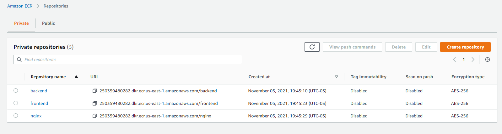
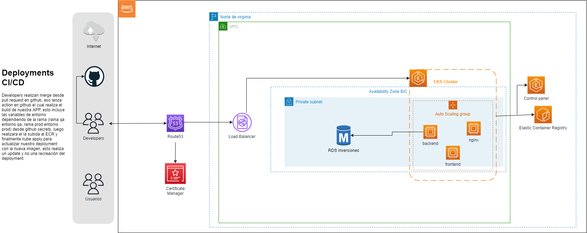
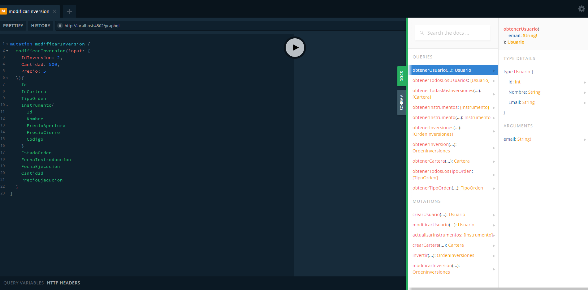
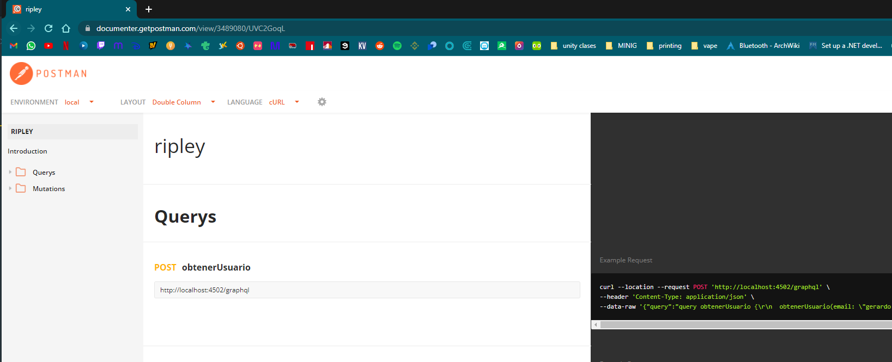

# Problema practico

Resolucion del problema practico planteado en el [readme principal](https://github.com/GMGOD/ripley/blob/master/README.md)

# Motivacion

Crear arquitectura y proyectosa asociados a la prueba practica

# Resumen
Para resumir, entre todas las tareas, las que se abordaron fueron la de arquitectura, backend y frontend. Lo que quedaria pendiente ya que no se realizo al 100% seria el frontend en angular.

### Oportunidad de mejora:
- La logica para obtener los instrumentos no queda muy clara o como realizar la logica de esta, por tal existe una oportunidad de mejora para tener un historial de instrumentos.
- Cron para obtener instrumentos; la api para actualizar los instrumentos esta hecha, es cosa de crear un Cron que llame a esta api cada X tiempo, recomiendo realizar un proyecto "crons" en node.js y que realize esta llamada cada X tiempo.
- Existe una tabla "usuarioHistorico"; la idea es 1 vez al mes con un cron rellenar esta tabla con el resultado mensual del usuario, o el diario, como se quiera, esto para evitar realizar querys pesadas en la base de datos.
- Agregarle usuario y contraseña a la pagina, para evitar que usuarios externos sin credenciales se conecten.
- prometheus: Esto no se instalo por que el nodeGroup ripley es de tipo t3.small y el numero de nodos que acepta AWS para este tipo de imagenes no nos alcanza para instalar todo, pero como instructivo para probarlo; Dentro de la carpeta [./aws/exports/deployments/metrics/](https://github.com/GMGOD/ripley/tree/master/problemaPractico/aws/exports/deployments/metrics) existe una carpeta llamada prometheus, este aplicativo nos sirve para revisar metrics con grafana, existe un archivo llamada [hack.sh](https://github.com/GMGOD/ripley/blob/master/problemaPractico/aws/exports/deployments/metrics/prometheus/hack.sh) para realizar la instalacion completa.

### Que falto:
- El Frontend se realizo en Angular ya que es lo que solicitaban, pero yo no tengo experiencia con el, de igual manera me propuse a realizarlo, en resumen, se hizo, listar todos los usuarios, agregar usuario, modificar usuario y comprar inversiones, todo lo demas se omitio por tiempo.
- En un punto se solicita utilizar Api Gateway, se intento crear una llamando a un NLB (Network Load Balancer) para llamar al EKS, pero sin exito, por tal se opto por el balanceador creado por kubernetes, se puede ver como quedo en el diagrama de arquitectura.

# Arquitectura

Para levantar la arquitectura es necesario definir ciertas cosas antes de crearla, en este caso solo se uso serverless para crear permisos necesarios, por tal con [Serverless Framework](https://www.serverless.com/framework/docs/getting-started) realizamos estas acciones

ir a la carpeta [./aws/yml/](https://github.com/GMGOD/ripley/tree/master/problemaPractico/aws/yml) y ejecutar despues de haber instalado Serverless Framework, ojo: el --aws-profile= corresponde al perfil que tengas configurado en tu maquina, si no tienes ninguno, este seria "default"

``$ sls deploy --stage prod --aws-profile=TuPerfil``

tomar el rol creado y pasarlo al archivo [./aws/scripts/cluster.sh](https://github.com/GMGOD/ripley/blob/master/problemaPractico/aws/scripts/cluster.sh) y tambien cambiar el --profile por el que tengas configurado, si no tienes ninguno, el profile seria 'default'

recordar que el perfil que coloques tiene que tener acceso a eks:CreateCluster si no dara error, por tal tambien se crea un rol kubernetesUserRole para asignarle al usuario, pero igual sera necesario agregar el eks:CreateCluster

Crear el nodegroup [./aws/scripts/nodegroup.sh](https://github.com/GMGOD/ripley/blob/master/problemaPractico/aws/scripts/nodegroup.sh)

## Crear repositorios ECR


## Diagrama Arquitectura


## Diagrama Base de datos


# Backend

Como ejecutar, sobre carpeta [problemaPractico](https://github.com/GMGOD/ripley/tree/master/problemaPractico) si estoy en linux
```
cd backend
npm i
npm run start:local
```
en windows
```
cd backend
npm i
npm run start:windows:local
```
dentro de el archivo .env esta la conexion a la database mysql, se debe instalar [mariadb](https://www.mariadbtutorial.com/getting-started/install-mariadb/), se debe ejecutar sobre la base de datos el archivo problemaPractico/inversiones.sql

El backend esta creado con node js y graphql, para realizar querys se puede hacer un post a ```http://localhost:4502/graphql```

Si queremos ver la documentacion, podemos ingresar directo a la ruta del post y nos mostrara apollo para crear querys, ver el esquema y la documentacion



Tambien estan publicadas en postman todos los post's y querys disponibles https://documenter.getpostman.com/view/3489080/UVC2GoqL

[](https://documenter.getpostman.com/view/3489080/UVC2GoqL)

# Frontend

Como ejecutar, sobre carpeta [problemaPractico](https://github.com/GMGOD/ripley/tree/master/problemaPractico)
```
cd frontend-angular
npm i
npm run start
```
luego ir a [http://localhost:4200/](http://localhost:4200/)

# Lineamientos de desarrollo
- Si queremos separar las aguas, implementar otro backend, recomiendo usar graphql y sacar su potencial, ya que podemos unir diferentes endpoints y entregarlos desde 1 graphql, por tal, podemos adjuntar diferentes fuentes de información en 1 solo backend.
- Si estamos trabajando con una APP mobile intentar reducir el tamaño de las querys a graphql para no realizar querys sin sentido a la base de datos (usar fields requeridos y entregar la info que se necesita).
- realizar subidas por medio de actions en github, si es un proyecto nuevo, implementarlo desde actions, bloquear los push a ramas principales como "desarrollo", "produccion" y realizar pull request's para revision y validación.
- a nivel de nginx bloquear URL's privadas que se utilizen con crons u otros, recordar que nginx define salida a internet y no los servicios.

# Deployment
Los deployments a EKS se realizan por medio de github actions, estos se activan cuando reciben un push a la rama master, esto se deja asi para hacerlo lo mas simple posible, si se quisiera separar por enviroment se crearian dos ramas, una QA y otra PROD, si alguna de estas llegase a recibir un push, se ejecuta su propio action, OJO que por medio de github secrets mantenemos nuestras llaves a AWS y enviroment.

# Respuestas

- Feature 1 (¿Que inversiones tengo?): Obtener todas las inversiones (Instrumentos y cantidad de acciones) de la cartera del señor Risopatron.
```
query obtenerTodasMisInversiones {
  obtenerTodasMisInversiones(email: "gerardo.manuel3@gmail.com"){
    Id
    IdUsuario
    Descripcion
    EstadoActivo
    OrdenInversiones {
      Id
      IdCartera
      TipoOrden
      Instrumento{
        Id
        Nombre
        PrecioApertura
        PrecioCierre
        Codigo
      }
      EstadoOrden
      FechaInstroduccion
      FechaEjecucion
      Cantidad
      PrecioEjecucion
    }
  }
}
```

- Feature 2 (Quiero invertir en otra cosa!): Agregar una inversión a la cartera del señor Risopatron. (Numero de acciones, Fecha de ultima actualización, Nombre, Monto de Inversión en CLP)
```
mutation invertir {
  invertir(input: {
    IdCartera: 1,
    IdTipoOrden: 1,
    IdInstrumento: 1,
    Cantidad: 10,
    Precio: 10
  }){
    Id
    IdCartera
    TipoOrden
    Instrumento{
      Id
      Nombre
      PrecioApertura
      PrecioCierre
      Codigo
    }
    EstadoOrden
    FechaInstroduccion
    FechaEjecucion
    Cantidad
    PrecioEjecucion
  }
}
```

- Feature 3 (Quiero invertir mas): Actualizar una inversión a la cartera del señor Risopatron. (Numero de acciones, Fecha de ultima actualización, Nombre, Monto de Inversión en CLP Actualizado)
```
mutation modificarInversion {
  modificarInversion(input: {
    IdInversion: 2,
    Cantidad: 500,
    Precio: 5
  }){
    Id
    IdCartera
    TipoOrden
    Instrumento{
      Id
      Nombre
      PrecioApertura
      PrecioCierre
      Codigo
    }
    EstadoOrden
    FechaInstroduccion
    FechaEjecucion
    Cantidad
    PrecioEjecucion
  }
}
```

- Feature 4 (¿Como van mis inversiones en Colbun S.A?): Obtener el estado (Rentabilidad y estado de inversión) de un instrumento en particular de la cartera.
```"* Obtiene todas las ordenes asiganadas a la cartera y instrumento"```

```
query obtenerInversionPorInstrumento {
  obtenerInversionPorInstrumento(idCartera: 1, idInstrumento: 1){
      Instrumento{
        Nombre
      }
      EstadoOrden
      Rentabilidad
  }
}
```

- Feature 5 (¿Como van mis inversiones, hoy estamos ganando o perdiendo?): Obtener el estado (Rentabilidad y estado de inversión) de toda la cartera.
```
query obtenerCartera {
  obtenerCartera(idCartera: 1){
    OrdenInversiones {
      Instrumento{
        Nombre
      }
      EstadoOrden
      Rentabilidad
    }
  }
}
```

- Feature 7 (¿Desde que comence como van mis inversiones?): Obtener el monto de ganancias/perdidas vs el dinero invertido de toda la cartera.
```
query obtenerHistoricoGananciasPerdidasCartera {
    obtenerHistoricoGananciasPerdidasCartera(email: "gerardo.manuel3@gmail.com"){
        Resultado
    }
}
```
### (Bonus Track)

- Feature 8: Crear nuevo usuario.
```
mutation crearUsuario {
  crearUsuario(input: {
    Nombre: "Risopatron",
    Email: "gerardo.manuel3@gmail.com"
  }){
    Id
    Nombre
    Email
  }
}
```

- Feature 9: Actualizar usuario.
```
mutation modificarUsuario {
  modificarUsuario(input: {
    Id: 2,
    Nombre: "Gerardo",
    Email: "gerardo.m1anuel@gmail.com"
  }){
    Id
    Nombre
    Email
  }
}
```

- Feature 10: Obtener todos los usuarios disponibles.
```
query obtenerTodosLosUsuarios {
  obtenerTodosLosUsuarios{
    Id
    Nombre
    Email
  }
}
```

- Feature 11: Comparar las inversiones de un usuario contra otro en terminos de ganancias/perdidas.
```
query compararHistoricoGananciasPerdidasCarteraUsuarioAB {
    compararHistoricoGananciasPerdidasCarteraUsuarioAB(emailUsuarioA: "gerar1do.m1anuel@gma123il.com", emailUsuarioB: "gerardo.manuel3@gmail.com"){
        Email
        Resultado
    }
}
```