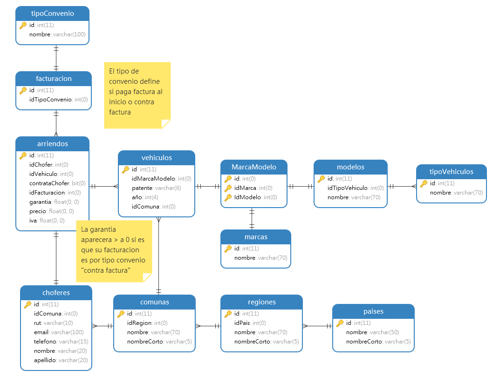
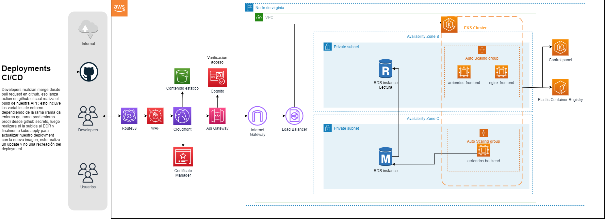

# Modelo


# Arquitectura

[](https://drive.google.com/file/d/1KF3McvbYUNj4k9GVFfBLQfdEF_nNrxS9/view?usp=sharing)
Si presionas en la imagen puedes ir al Draw

# Branching

Al caer un nuevo push en la rama desarrollo, se subira a QA desde github actions, esto usandos secrets configurados en el proyecto, este archivo esta dentro de .github/workflows/nombreArchivo.yml

## OJO
Esto solo contempla el deployment, si quisieramos volver a una build anterior en caso de que fallase, se realizaria otro tipo de deployment, uno que registra como realease y crea tag's, de esa manera al eliminar el ultimo tag, con una accion podriamos subir el tag anterior, evitando recompilar y peder tiempo en el deployment.

## EJ:

Esta linea define en la accion push en rama desarrollo.
```
on:
  push:
    branches:
      - desarrollo

```

Luego definimos el nombre de la accion y luego las variables de entorno, aca se obtienen las variables de entorno para QA, si quisieramos obtener la de prod tendriamos que crearla, diferente nombre a la que tenemos para QA.
```
name: CI/CD QA

env:
  AWS_DEFAULT_REGION: us-east-1
  AWS_DEFAULT_OUTPUT: json
  AWS_ACCOUNT_ID: ${{ secrets.AWS_ACCOUNT_ID }}
  AWS_ACCESS_KEY_ID: ${{ secrets.AWS_ACCESS_KEY_ID }}
  AWS_SECRET_ACCESS_KEY: ${{ secrets.AWS_SECRET_ACCESS_KEY }}
  KUBE_CONFIG_DATA: ${{ secrets.KUBE_CONFIG_DATA }}
  ENVIROMENTFILE: ${{ secrets.ENVIROMENT }}
  REGION: ${{ secrets.REGION }}
  FOLDER: frontend
  PROJECT: arriendo-frontend
  CONTAINER_IMAGE: arriendo-frontend:${{ github.sha }}
```

Definimos los jobs, aca le decimos que corra en ubuntu-latest.
```
jobs:
  build-and-push:
    name: Build and deploy
    runs-on: ubuntu-latest
```

Los steps a realizar, primero el checkout a la rama de la accion.
```
steps:

    - name: Checkout 🛎️
      uses: actions/checkout@master
```

Nos logeamos a la cuenta de amazon al servicio ECR con docker.
```
    - name: Setup ECR 🔧
      run: |
        # Login to AWS ECR
        docker login -u AWS -p $(aws ecr get-login-password --region $REGION) $AWS_ACCOUNT_ID.dkr.ecr.us-east-1.amazonaws.com
```

Seteamos el enviroment file, en nuestra secret tenemos las variables en base64, que luego en el step realizamos decode al archivo que corresponde.
```
    - name: Set env file 🎓
      run: |
          echo ${{ env.ENVIROMENTFILE }} | base64 -d > ./${{ env.FOLDER }}/.env
```

Con docker realizamos el build de la imagen correspondiente al enviroment, esto nos permite realizar ciertas acciones en docker, en este caso compilar especificamente para QA sin mimificado, el dockerfile de produccion contendria mimificado.
```
    - name: Build and tag the image 🌔
      run: |
        docker build \
          -t $CONTAINER_IMAGE ./$FOLDER \
          -t $AWS_ACCOUNT_ID.dkr.ecr.$AWS_DEFAULT_REGION.amazonaws.com/$CONTAINER_IMAGE \
          -f ./$FOLDER/dockerfile.qa
```

Realizamos la subida a ECR de nuestra imagen, solo si la referencia es de la rama de desarrollo.
```
    - name: Push to ecr AWS ⏭
      if: github.ref == 'refs/heads/desarrollo'
      run: |
        # Push image to AWS ECR
        docker push $AWS_ACCOUNT_ID.dkr.ecr.$AWS_DEFAULT_REGION.amazonaws.com/$CONTAINER_IMAGE
```

Configuramos las credenciales para realizar la actualizacion del deployment en kubernetes
```
    - name: AWS Credentials 🐒
      uses: aws-actions/configure-aws-credentials@v1
      with:
        aws-access-key-id: ${{ env.AWS_ACCESS_KEY_ID }}
        aws-secret-access-key: ${{ env.AWS_SECRET_ACCESS_KEY }}
        aws-region: ${{ env.REGION }}
```

Realizamos el trigger a travez de la imagen publica, esta fue modificada por mi ya que no estaba funcionando con las ultimas versiones de AWS cli.
```
    - name: Trigger deploy 🚀
      uses: equipotoctoc/kubernetes-action@main
      env:
        KUBE_CONFIG_DATA: ${{ env.KUBE_CONFIG_DATA }}
      with:
        args: --record deployment.apps/${{ env.PROJECT }} set image deployment.apps/${{ env.PROJECT }} ${{ env.PROJECT }}=${{ env.AWS_ACCOUNT_ID }}.dkr.ecr.${{ env.REGION }}.amazonaws.com/${{ env.PROJECT }}:${{ github.sha }}
```

En resumen, el archivo
```
on:
  push:
    branches:
      - desarrollo

name: CI/CD QA

env:
  AWS_DEFAULT_REGION: us-east-1
  AWS_DEFAULT_OUTPUT: json
  AWS_ACCOUNT_ID: ${{ secrets.AWS_ACCOUNT_ID }}
  AWS_ACCESS_KEY_ID: ${{ secrets.AWS_ACCESS_KEY_ID }}
  AWS_SECRET_ACCESS_KEY: ${{ secrets.AWS_SECRET_ACCESS_KEY }}
  KUBE_CONFIG_DATA: ${{ secrets.KUBE_CONFIG_DATA }}
  ENVIROMENTFILE: ${{ secrets.ENVIROMENT }}
  REGION: ${{ secrets.REGION }}
  FOLDER: frontend
  PROJECT: arriendo-frontend
  CONTAINER_IMAGE: arriendo-frontend:${{ github.sha }}

jobs:
  build-and-push:
    name: Build and deploy
    runs-on: ubuntu-latest
    steps:

    - name: Checkout 🛎️
      uses: actions/checkout@master
      
    - name: Setup ECR 🔧
      run: |
        # Login to AWS ECR
        docker login -u AWS -p $(aws ecr get-login-password --region $REGION) $AWS_ACCOUNT_ID.dkr.ecr.us-east-1.amazonaws.com

    - name: Set env file 🎓
      run: |
          echo ${{ env.ENVIROMENTFILE }} | base64 -d > ./${{ env.FOLDER }}/.env

    - name: Build and tag the image 🌔
      run: |
        docker build \
          -t $CONTAINER_IMAGE ./$FOLDER \
          -t $AWS_ACCOUNT_ID.dkr.ecr.$AWS_DEFAULT_REGION.amazonaws.com/$CONTAINER_IMAGE \
          -f ./$FOLDER/dockerfile.qa

    - name: Push to ecr AWS ⏭
      if: github.ref == 'refs/heads/desarrollo'
      run: |
        # Push image to AWS ECR
        docker push $AWS_ACCOUNT_ID.dkr.ecr.$AWS_DEFAULT_REGION.amazonaws.com/$CONTAINER_IMAGE

    - name: AWS Credentials 🐒
      uses: aws-actions/configure-aws-credentials@v1
      with:
        aws-access-key-id: ${{ env.AWS_ACCESS_KEY_ID }}
        aws-secret-access-key: ${{ env.AWS_SECRET_ACCESS_KEY }}
        aws-region: ${{ env.REGION }}

    - name: Trigger deploy 🚀
      uses: equipotoctoc/kubernetes-action@main
      env:
        KUBE_CONFIG_DATA: ${{ env.KUBE_CONFIG_DATA }}
      with:
        args: --record deployment.apps/${{ env.PROJECT }} set image deployment.apps/${{ env.PROJECT }} ${{ env.PROJECT }}=${{ env.AWS_ACCOUNT_ID }}.dkr.ecr.${{ env.REGION }}.amazonaws.com/${{ env.PROJECT }}:${{ github.sha }}
```